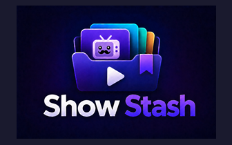

# Show Stash



Show Stash is an open-source Roku SceneGraph channel for keeping a short, household-friendly list of favorite shows and launching the streaming service where each show is watched.

The app is meant for the common living-room problem: everyone remembers the show they want to watch, but not always which service has it. Add shows to a shared household list, use optional TMDb lookup to find metadata and likely providers, then select a show from the main screen to open the matching Roku channel.

## Features

- Add favorite shows from the Roku UI.
- Search TMDb while adding a show when an API key is configured.
- Choose from TMDb matches or fall back to manual service selection.
- Keep the entered show name available for editing when backing out of TMDb match results.
- Map supported TMDb watch providers to Roku channel IDs.
- Save shows locally in the Roku registry.
- Sync a household show list through Firebase Realtime Database.
- Create or join a household using a generated household code.
- Launch the selected show's streaming service.
- Open a Settings screen to view and edit the TMDb API key.
- Optionally save Hulu and ESPN matches as Disney+ for Disney bundle workflows.
- Focus the newly added show in the main list after it is saved.

## Using the Channel

1. Launch Show Stash on your Roku.
2. Create a new household code on the first Roku, or join an existing household from another Roku.
3. Press `Fast Forward` to add a show.
4. Enter the show name.
5. Pick the correct TMDb match when available, or choose the streaming service manually.
6. Select a saved show from the main list to open its streaming service.

### Controls

- `OK` or `Play`: Launch the selected show's streaming service or confirm the current selection.
- `Fast Forward`: Add a show.
- `*` / Options: Open Settings.
- `Rewind`: Remove the selected show.
- `Back`: Return from add/settings flows, or exit the channel from the main screen.
- `Home`: Exit the channel.

## Configuration

### TMDb

TMDb lookup uses the `TMDbApiKey` value stored in the Roku registry. Users can edit this from the Settings screen.

Do not commit private TMDb API keys to this repository. Use the Settings screen on each Roku device to store the key locally.

TMDb attribution is shown on the Settings screen:

> This product uses the TMDb API but is not endorsed or certified by TMDb.

### Settings

Settings are stored in the Roku registry under the `RokuTracker` section.

- `TMDbApiKey`: TMDb API key used for metadata lookup.
- `useDisneyForHuluAndESPN`: When `true`, shows whose selected or detected service is Hulu, ESPN, or ESPN+ are saved as Disney+ instead.

### Firebase

Household sync is currently configured in `components/FirebaseTask.brs` with this Firebase Realtime Database URL:

```text
https://roku-tracker-default-rtdb.firebaseio.com
```

If you deploy your own version, update that endpoint and configure Firebase security rules for your own project before distributing the channel.

## Supported Streaming Services

The current manual service list includes:

- Netflix
- Hulu
- Disney+
- ESPN
- Amazon Prime
- Max
- Apple TV+
- Peacock
- Paramount+

Provider mappings live in `components/TMDbMetadataProvider.brs`, and manual service choices live in `components/AddShow.brs`. TMDb providers may also be accepted even when they are not shown in the manual service list.

## Development

This is a standard Roku SceneGraph channel written in BrightScript and SceneGraph XML.

### Project Structure

```text
.
|-- manifest
|-- README.md
|-- CHANGELOG.md
|-- CONTRIBUTING.md
|-- LICENSE
|-- SECURITY.md
|-- TRADEMARKS.md
|-- source/
|   `-- main.brs
|-- components/
|   |-- MainScene.xml
|   |-- MainScene.brs
|   |-- AddShow.xml
|   |-- AddShow.brs
|   |-- SettingsScreen.xml
|   |-- SettingsScreen.brs
|   |-- SetupScreen.xml
|   |-- SetupScreen.brs
|   |-- MetadataSearchTask.xml
|   |-- MetadataSearchTask.brs
|   |-- TMDbMetadataProvider.brs
|   |-- ShowList.xml
|   |-- ShowList.brs
|   |-- LaunchTask.xml
|   |-- LaunchTask.brs
|   |-- FirebaseTask.xml
|   `-- FirebaseTask.brs
|-- docs/
|   |-- CERTIFICATION_NOTES.md
|   |-- PRIVACY.md
|   |-- ROKU_SUBMISSION.md
|   |-- SUPPORT.md
|   `-- TERMS.md
|-- images/
|   |-- channel-poster_fhd.png
|   |-- icon_focus_hd.png
|   |-- icon_focus_sd.png
|   |-- splash_screen_fhd.png
|   `-- Show Stash Icon with Moustache.png
`-- store-assets/
    |-- store-poster_540x405.png
    `-- store-screenshot_1920x1080.png
```

### Key Components

- `MainScene` controls the main show list, keyboard shortcuts, add/settings overlays, deletion, sync, and launch flow.
- `ShowList` keeps normal list navigation while intercepting main-screen transport shortcuts before Roku's list paging behavior handles them.
- `AddShow` handles show entry, TMDb match selection, and fallback manual service selection.
- `SettingsScreen` displays and edits the TMDb API key, toggles app preferences, and includes application attribution/copyright information.
- `TMDbMetadataProvider` searches TMDb, scores possible matches, fetches watch providers, and maps supported providers to Roku app IDs.
- `FirebaseTask` fetches and pushes household show lists to Firebase Realtime Database.
- `LaunchTask` launches an installed Roku app by app ID, or opens the Channel Store springboard if the app is not installed.
- `SetupScreen` creates or joins a shared household.

### Sideloading for Testing

1. Enable Developer Mode on the Roku device.
2. Run `Build Package.ps1` to create a clean sideload zip in `Backups/`.
3. Upload the generated zip through the Roku developer web installer.
4. Launch the sideloaded channel on the device.

The package should include `manifest`, `source/`, `components/`, and `images/`.

For Roku Developer Dashboard submission, use the Roku device packager to create the signed `.pkg` from the tested sideload zip. See `docs/ROKU_SUBMISSION.md`.

### Roku Submission

Submission preparation lives in `docs/ROKU_SUBMISSION.md`. Important supporting docs are:

- `docs/PRIVACY.md`
- `docs/TERMS.md`
- `docs/SUPPORT.md`
- `docs/CERTIFICATION_NOTES.md`

The `store-assets/` folder contains starter Channel Store artwork. Replace the starter screenshot with real on-device screenshots before public submission.

## Roadmap

Show Stash currently launches the streaming service associated with a show. A future goal is direct program launch where possible. That will require provider-specific content IDs and Roku deep-link parameters supported by each streaming provider.

Other useful areas for contribution include:

- More provider mappings.
- Safer public-repo configuration for API keys and Firebase endpoints.
- Additional documentation for deploying a private Firebase project.
- Roku device testing notes across different models and OS versions.

## Contributing

Issues and pull requests are welcome. Before opening a pull request:

1. Keep changes focused and describe the user-facing behavior.
2. Update `README.md` when behavior, setup, controls, configuration, or project structure changes.
3. Bump `minor_version` in `manifest` for each project change.
4. Avoid committing private API keys, local device credentials, or private Firebase configuration.
5. Test on a Roku device when the change affects channel behavior.

See `CONTRIBUTING.md` and `SECURITY.md` for more details.

Generated Roku packages, signing credentials, local environment files, Firebase service account files, and editor/system noise are excluded by `.gitignore`.

## Trademarks

Pearl Lane, Show Stash, and the Show Stash TV-face-and-moustache logo are trademarks claimed by Pearl Lane, LLC. Pearl Lane has been submitted as a trademark application and is pending processing. See `TRADEMARKS.md`.

## Notes

- The app targets FHD UI resolution.
- Show data is stored as JSON in the Roku registry under the `RokuTracker` section.
- Household sync uses a shared household code and stores shows under `/households/{householdCode}/shows.json`.
- Direct program deep linking is not implemented yet.

## License

Show Stash is licensed under the GNU General Public License version 3. See `LICENSE` for the full license text and the project-specific GPLv3 section 7 attribution and trademark notices.

## Acknowledgments

Show Stash uses TMDb metadata when a TMDb API key is configured. This product uses the TMDb API but is not endorsed or certified by TMDb.

## Copyright

Copyright (c) 2026 by Pearl Lane, LLC

Website: https://PearlLane.com/ShowStash

Support: hello@PearlLane.com

Pearl Lane, LLC

12128 N Division St Ste 1520

Spokane, WA 99218
